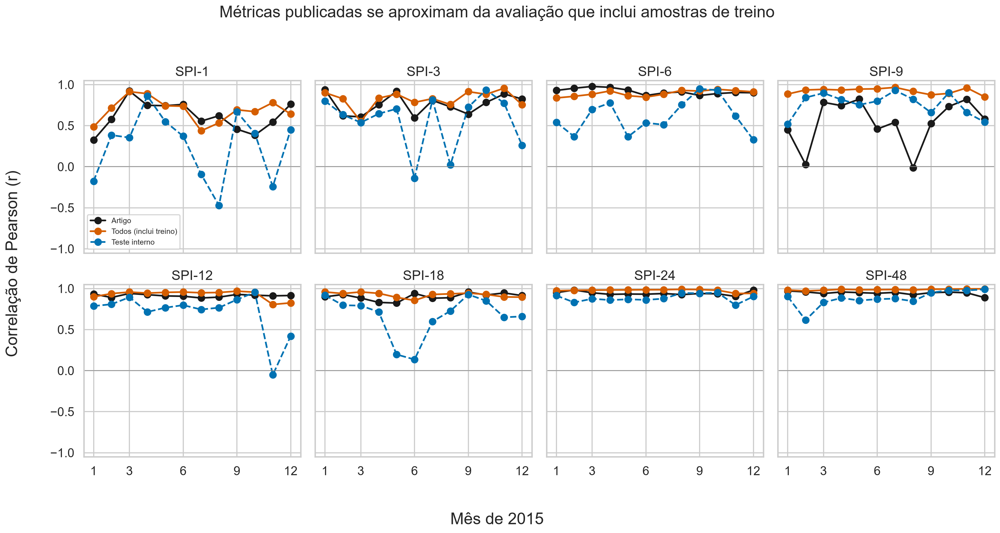
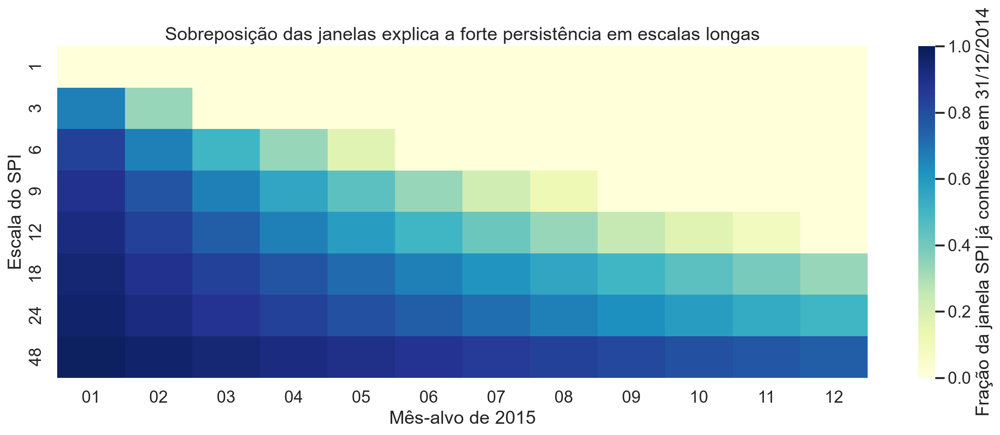
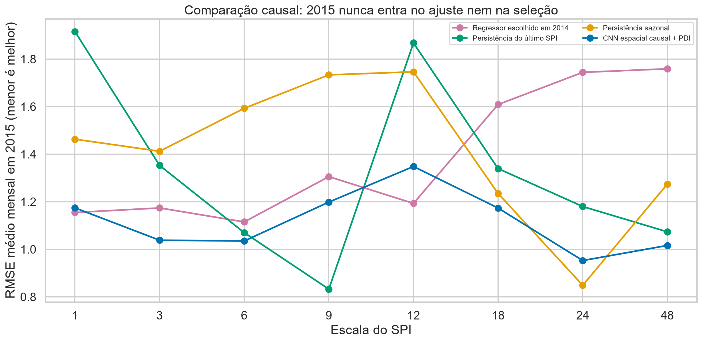

# Auditoria de reprodutibilidade, vazamento de dados e melhorias causais

## Resumo executivo

**Conclusão: há vazamento de dados no protocolo descrito pelo artigo, e as métricas publicadas não devem ser interpretadas como desempenho de uma previsão temporal independente de 2015.**

A ausência do código e dos pesos originais impede uma perícia bit a bit da implementação dos autores. Ainda assim, duas conclusões são sustentadas pelo texto e pela reprodução:

1. o desempenho em 2015 é reutilizado para escolher a ANN nº 15 entre 17 configurações, contaminando o conjunto que deveria funcionar como teste final;
2. na reconstrução coerente com as figuras e a divisão 70%/15%/15%, 70% dos próprios rótulos de SPI de 2015 entram no ajuste. Quando as amostras são ordenadas por ponto espacial, as correlações publicadas ficam mais próximas da avaliação sobre **todos os 169 pontos, incluindo treino**, do que do teste interno em 7 das 8 escalas.

O erro absoluto médio entre as correlações mensais publicadas e as reproduzidas foi **0,105** quando se avaliaram todos os pontos, contra **0,232** quando se avaliou apenas o teste interno. Isso é evidência empírica forte de que os números publicados incorporam amostras usadas no ajuste ou uma dependência espacial equivalente.

Em seguida, foi executado um protocolo estritamente causal: treino até 2013, seleção/early stopping em 2014 e teste único em 2015. Uma CNN residual espacial com convoluções 3×3 e perda de gradiente — componente de PDI — reduziu o RMSE médio mensal frente ao regressor selecionado em 2014 em 6 das 8 escalas, com ganho médio de **15,9%**. O ganho não foi universal: persistência ainda venceu em SPI-9 e SPI-24, e a CNN não melhorou o regressor selecionado em SPI-1 e SPI-12.

## Materiais analisados

- artigo científico: `Artificial neural network-based forecasting of SPI for extreme event analysis in the Upper S o Francisco sub-basin.pdf`;
- áudio da reunião: `WhatsApp Audio 2026-07-29 at 12.10.24.mp4`;
- síntese revisada da reunião: `outputs/transcricao/sintese_reuniao.md`;
- tabelas publicadas transcritas: `reference/article_table2_r.csv` e `reference/article_table3_kappa.csv`.

A transcrição automática foi revisada pelo conteúdo. As falas curtas dos três estudantes não foram atribuídas individualmente a Renan, João e André quando a identidade vocal não pôde ser determinada com segurança.

## Aquisição e validação dos dados

O projeto foi registrado no Google Earth Engine para uso acadêmico não comercial, nível Comunidade, sem conta de faturamento. O extrator local está em `scripts/gee_export_trmm.js`.

Foram reproduzidas as especificações declaradas no artigo:

| Item | Valor validado |
|---|---:|
| Produto | TRMM 3B42 V7 |
| Período | janeiro/1998 a dezembro/2015 |
| Meses | 216 |
| Grade | 13 × 13 |
| Pontos | 169 |
| Linhas do CSV | 36.504 |
| Latitude | −21,00 a −18,00, passo 0,25° |
| Longitude | −46,75 a −43,75, passo 0,25° |
| Ausências | 0 |
| Duplicações mês-ponto | 0 |
| Precipitação | 0,00 a 619,72 mm/mês |

Dois erros silenciosos foram detectados e corrigidos antes do treinamento:

1. `ee.Date.difference(..., 'month')` retornava um valor fracionário que fazia `ee.List.sequence` omitir dezembro de 2015; o intervalo foi fixado explicitamente em 216 meses;
2. `ee.Reducer.first()` nomeava a saída como `first`, enquanto o CSV solicitava `precipitation_mm`; a saída do redutor passou a ser nomeada explicitamente.

O CSV final está em `data/raw/trmm_3b42_monthly_1998_2015_upper_sao_francisco.csv`. A pasta `data/raw` foi mantida no `.gitignore` por ser dado derivado e reproduzível.

## Reconstrução do protocolo do artigo

A interpretação mais compatível com as figuras é:

- cada amostra representa um par **mês-ponto** de 2015;
- os atributos são os valores daquele mesmo mês e ponto nos anos anteriores;
- a ANN nº 15 usa 15 atributos, correspondentes a 2000–2014;
- o rótulo é o SPI correspondente em 2015;
- há 12 × 169 = 2.028 amostras por escala;
- a divisão sequencial 70%/15%/15% contém 1.419 amostras de treino, 304 de validação e 305 de teste.

A MLP usada na reprodução possui 11 neurônios ocultos, ativação logística, saída linear, padronização de entradas e alvo e otimizador L-BFGS como aproximação de segunda ordem ao Levenberg–Marquardt. Não é possível obter igualdade numérica exata porque o artigo não publica código, pesos, sementes, forma de inicialização, ordem das amostras nem todos os critérios de parada. Em algumas escalas, a MLP alcançou o limite de 1.000 iterações.

## Evidências de vazamento

### 1. Rótulos de 2015 entram no ajuste

Se a divisão 70%/15%/15% é aplicada às 2.028 amostras que têm 2015 como alvo, então 1.419 rótulos do ano anunciado como “previsto” são usados no treinamento. O problema não depende de a divisão ser temporal ou espacial: em ambos os casos, 2015 deixa de ser um teste externo.

Na ordenação por ponto espacial, todos os 12 meses aparecem em cada partição. O treino contém 119 pontos, a validação 26 e o teste 26, com pontos de fronteira compartilhados entre as faixas por causa do corte no meio de um ponto. Os pontos de treino e teste também são espacialmente vizinhos.

### 2. Métricas publicadas se parecem com avaliação que inclui treino



| SPI | erro médio de `r`: artigo × todos | erro médio de `r`: artigo × teste | mais próximo de todos? |
|---:|---:|---:|:---:|
| 1 | 0,130 | 0,419 | sim |
| 3 | 0,098 | 0,242 | sim |
| 6 | 0,049 | 0,323 | sim |
| 9 | 0,381 | 0,267 | não |
| 12 | 0,050 | 0,213 | sim |
| 18 | 0,049 | 0,240 | sim |
| 24 | 0,042 | 0,062 | sim |
| 48 | 0,042 | 0,089 | sim |

O resultado não prova que os autores usaram exatamente a mesma ordem de amostras, mas mostra que o comportamento publicado é muito mais compatível com uma avaliação contaminada do que com o teste interno isolado.

### 3. O teste de 2015 é reutilizado para escolher o modelo

O artigo compara 17 modelos definidos pelo número de anos de entrada e escolhe a ANN nº 15 a partir do desempenho das previsões de 2015. Mesmo que a divisão interna 70%/15%/15% estivesse correta, essa escolha usa o teste final para seleção de hiperparâmetro. O desempenho resultante é otimista.

### 4. O SPI provavelmente é calibrado com o período completo

O artigo calcula os SPIs no período completo antes de explicar as partições e não informa um corte de calibração. Ajustar a distribuição Gamma com dados até dezembro de 2015 transfere informação da distribuição do teste para treino e validação. Na auditoria causal, os parâmetros do SPI foram calibrados somente até dezembro de 2013.

## O que não deve ser chamado de vazamento

A sobreposição das janelas acumuladas não é, por si só, vazamento se todos os meses usados já eram conhecidos na data de origem. Ela é, porém, uma fonte enorme de persistência e torna enganosa a interpretação de “previsão de 12 meses”.



Em 31/12/2014:

- o SPI-48 de janeiro/2015 já contém 47 de 48 meses conhecidos, ou 97,9%;
- o SPI-48 de dezembro/2015 ainda contém 36 de 48 meses conhecidos, ou 75,0%;
- o SPI-24 varia de 95,8% conhecido em janeiro a 50,0% em dezembro;
- o SPI-1 não contém nenhum mês conhecido de 2015.

Portanto, correlações altas em SPI-24 e SPI-48 podem refletir a própria definição do índice e devem sempre ser comparadas com persistência.

## Protocolo causal usado na melhoria

O protocolo corrigido foi definido antes de observar o teste:

- SPI calibrado somente com dados até 31/12/2013;
- treino com origens anteriores a dezembro/2013;
- origem de validação em dezembro/2013, com alvos de 2014;
- origem de teste em dezembro/2014, com os 12 alvos de 2015;
- escolha entre Ridge, MLP e Extra Trees exclusivamente pela RMSE de 2014;
- 2015 usado uma única vez;
- comparação com persistência do último SPI e persistência sazonal.

Os modelos tabulares recebem os 12 meses anteriores e produzem os 12 meses seguintes. A CNN recebe os últimos 12 mapas 13×13, prevê o próximo mapa e opera recursivamente por 12 passos.

## PDI e deep learning

A arquitetura `SpatialResidualCNN` aplica:

- 12 mapas anteriores como canais de entrada;
- duas convoluções 3×3 com 32 filtros e ReLU;
- conexão residual com o último mapa observado;
- perda MSE somada a uma penalização do gradiente espacial horizontal e vertical;
- AdamW, early stopping em 2014 e previsão recursiva de 2015.

A penalização de gradiente é a etapa de PDI: ela força o modelo a preservar transições espaciais e contornos dos campos de SPI, em vez de otimizar apenas valores ponto a ponto.



| SPI | regressor escolhido em 2014 | RMSE regressor | RMSE CNN | ganho da CNN | melhor persistência (diagnóstico) | RMSE persistência | melhor no teste |
|---:|---|---:|---:|---:|---|---:|---|
| 1 | MLP-11 | 1,155 | 1,174 | −1,7% | sazonal | 1,463 | MLP-11 |
| 3 | MLP-11 | 1,174 | 1,038 | +11,6% | último SPI | 1,353 | CNN |
| 6 | Ridge | 1,115 | 1,035 | +7,2% | último SPI | 1,070 | CNN |
| 9 | MLP-11 | 1,306 | 1,199 | +8,2% | último SPI | 0,833 | persistência |
| 12 | MLP-11 | 1,193 | 1,348 | −13,0% | sazonal | 1,747 | MLP-11 |
| 18 | MLP-11 | 1,609 | 1,174 | +27,1% | sazonal | 1,235 | CNN |
| 24 | MLP-11 | 1,744 | 0,953 | +45,4% | sazonal | 0,849 | persistência |
| 48 | MLP-11 | 1,759 | 1,016 | +42,2% | último SPI | 1,074 | CNN |

“Melhor persistência” é apresentado como diagnóstico no teste, não como modelo escolhido de forma válida depois de olhar 2015. Em uma continuação, todas as persistências e combinações híbridas devem entrar na seleção feita em 2014.

A CNN foi o melhor dos três grupos em 4 das 8 escalas e superou o regressor selecionado em 6 das 8. Seu kappa médio mensal permaneceu baixo, com máximo de aproximadamente 0,20, portanto a classificação de extremos ainda não está resolvida.

## Limitações científicas restantes

1. **Série curta para SPI:** o artigo usa somente 18 anos. O guia da WMO recomenda idealmente pelo menos 30 anos e cerca de 50–60 anos é preferível. Para caudas de escalas acima de 24 meses, até 50–60 anos pode ser insuficiente; 80–100 anos é indicado para maior confiança.
2. **SPI-48 inicial:** dados iniciados em 1998 não fornecem uma janela completa de 48 meses em 2000. A reprodução permissiva aceita janelas parciais porque é a única forma de conciliar a cronologia declarada, mas isso precisa ser explicitado.
3. **Ano de teste único:** 2015 pode representar uma mudança de distribuição. É necessário backtesting com várias origens anuais bloqueadas.
4. **Dependência espacial:** validação futura deve usar blocos espaciais quando o objetivo incluir transferência geográfica.
5. **Extremos raros:** RMSE e correlação não bastam. Devem ser adicionados recall/precision por classe de seca, erro de duração e intensidade de eventos, Brier score e intervalos de confiança por bootstrap em blocos.
6. **Produto de precipitação:** uma extensão deve comparar TRMM com CHIRPS, ERA5-Land ou GPM e quantificar incerteza do produto.

## Próximos experimentos recomendados

1. usar uma série mais longa e recalibrar o SPI dentro de cada janela de treino;
2. executar backtesting com origens anuais múltiplas e janela expansiva;
3. incluir persistências na seleção de 2014, não apenas na avaliação final;
4. testar híbridos CNN + persistência com peso escolhido por validação;
5. adicionar precipitação, mês do ano e variáveis oceânico-atmosféricas como entradas, sempre respeitando a disponibilidade temporal;
6. avaliar U-Net/ConvLSTM pequena somente depois que baselines e protocolos estiverem congelados;
7. publicar a ordem das amostras, sementes, versões, pesos e todos os resultados por partição.

## Como reproduzir

```powershell
.\.venv\Scripts\python.exe -m pytest -q
.\.venv\Scripts\python.exe scripts\run_audit.py "data\raw\trmm_3b42_monthly_1998_2015_upper_sao_francisco.csv" --output "outputs\resultados\reproducao_real" --scales 1 3 6 9 12 18 24 48
.\.venv\Scripts\python.exe scripts\analyze_paper_orderings.py "outputs\resultados\reproducao_real"
.\.venv\Scripts\python.exe scripts\run_deep_only.py "outputs\resultados\reproducao_real" --scales 1 3 6 9 12 18 24 48
.\.venv\Scripts\python.exe scripts\build_final_plots.py "outputs\resultados\reproducao_real"
```

## Artefatos principais

- métricas do protocolo semelhante ao artigo: `outputs/resultados/reproducao_real/paper_like_metrics_by_split.csv`;
- ordenação espacial e partições: `outputs/resultados/reproducao_real/paper_like_point_major_partitions.csv`;
- comparação mensal publicada × reprodução: `outputs/resultados/reproducao_real/reported_vs_point_major_monthly_r.csv`;
- métricas causais tabulares: `outputs/resultados/reproducao_real/causal_metrics.csv`;
- métricas da CNN: `outputs/resultados/reproducao_real/causal_pdi_cnn_metrics.csv`;
- resumo de modelos: `outputs/resultados/reproducao_real/causal_model_summary.csv`;
- previsões CNN de 2015: `outputs/resultados/reproducao_real/spi_*_cnn_prediction_2015.nc`;
- código-fonte: `src/spi_audit/` e `scripts/`.

## Referências metodológicas

- World Meteorological Organization. *Standardized Precipitation Index User Guide*, WMO-No. 1090, 2012. https://www.droughtmanagement.info/literature/WMO_standardized_precipitation_index_user_guide_en_2012.pdf
- Roberts, D. R. et al. (2017). *Cross-validation strategies for data with temporal, spatial, hierarchical, or phylogenetic structure*. Ecography 40:913–929. https://doi.org/10.1111/ecog.02881
- Catálogo oficial do TRMM 3B42 no Earth Engine: https://developers.google.com/earth-engine/datasets/catalog/TRMM_3B42
- API oficial usada para o download da tabela: https://developers.google.com/earth-engine/apidocs/ee-featurecollection-getdownloadurl
